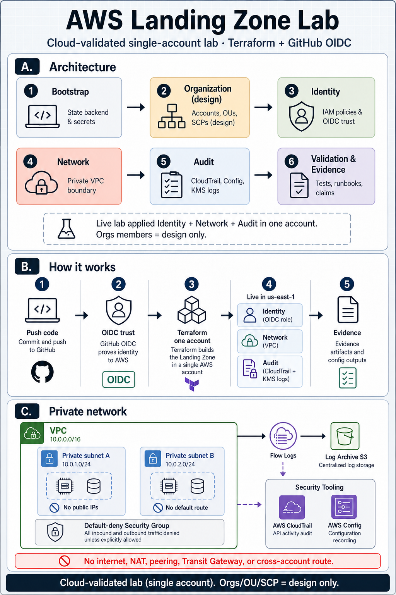

# AWS Landing Zone Lab

Terraform + GitHub OIDC CI. **Cloud-validated** single-account lab in `us-east-1`: identity, private network, and audit. Multi-account Orgs/OU/SCP interfaces stay design-only.

Formerly the `cloud` monorepo; the Ralphy smoke harness now lives in
[`nathanielecon/ralphy-windows-harness`](https://github.com/nathanielecon/ralphy-windows-harness).

## Diagram

  

  <a href="platform/docs/diagrams/aws-landing-zone-lab.drawio">Editable draw.io source</a>

| Panel | What it shows |
|-------|----------------|
| **A. Architecture** | Bootstrap → Organization (design) → Identity → Network → Audit → Validation. Live lab applied identity + network + audit in one account. |
| **B. How it works** | Push → OIDC → Terraform (one account) → live resources → evidence. |
| **C. Private network** | Private subnets, default-deny SG, Flow Logs → Log Archive. No internet, NAT, peering, Transit Gateway, or cross-account route. |

## Repo map

| Path | What it is |
|------|------------|
| **This README** | Recruiter face: what was cloud-validated and what was not |
| [`platform/`](platform/) | Engineering surface — multi-account **design contract**, Terraform modules, docs, and the live lab |
| [`platform/sandbox/landing-zone-lab/`](platform/sandbox/landing-zone-lab/) | **Cloud-validated** single-account lab (OIDC → Terraform CI) |
| [`evidence/platform/`](evidence/platform/) | Historical A-001…A-007 design-gate receipts (repo-only; not cloud proof) |
| Sibling: [ralphy-windows-harness](https://github.com/nathanielecon/ralphy-windows-harness) | Sequential Ralphy/Codex smoke harness (separate product) |

## Resume bullet

> Designed a multi-account AWS Landing Zone (Orgs/OU/SCP interfaces) and cloud-validated a single-account lab composition of identity, private network, and audit (CloudTrail/KMS Log Archive) in `us-east-1` with Terraform, evidence, and CI-gated delivery.

## Proven vs not

**Cloud-validated (live lab)** — single-account `us-east-1`; OIDC role `project-a-lzlab-gha`; private VPC + flow logs; CloudTrail / Config / KMS Log Archive; CI-gated Terraform apply with written evidence.

**Not proven** — multi-account Organizations with real member accounts; enterprise production operations; Azure Government (translation docs only). This repository does **not** prove production deployment or senior-level platform ownership.

Details: [`platform/docs/portfolio/claims-boundary.md`](platform/docs/portfolio/claims-boundary.md).

## Where to look next

| Want… | Go here |
|-------|---------|
| How `platform/` connects | [`platform/README.md`](platform/README.md) |
| Architecture contract | [`platform/docs/architecture/overview.md`](platform/docs/architecture/overview.md) |
| Live lab evidence | [`platform/sandbox/landing-zone-lab/EVIDENCE.md`](platform/sandbox/landing-zone-lab/EVIDENCE.md) |
| Orgs design interface | [`platform/sandbox/landing-zone-lab/ORGS_INTERFACE.md`](platform/sandbox/landing-zone-lab/ORGS_INTERFACE.md) |
| OIDC trust after repo rename | [`platform/sandbox/landing-zone-lab/ci-bootstrap/README.md`](platform/sandbox/landing-zone-lab/ci-bootstrap/README.md) |
