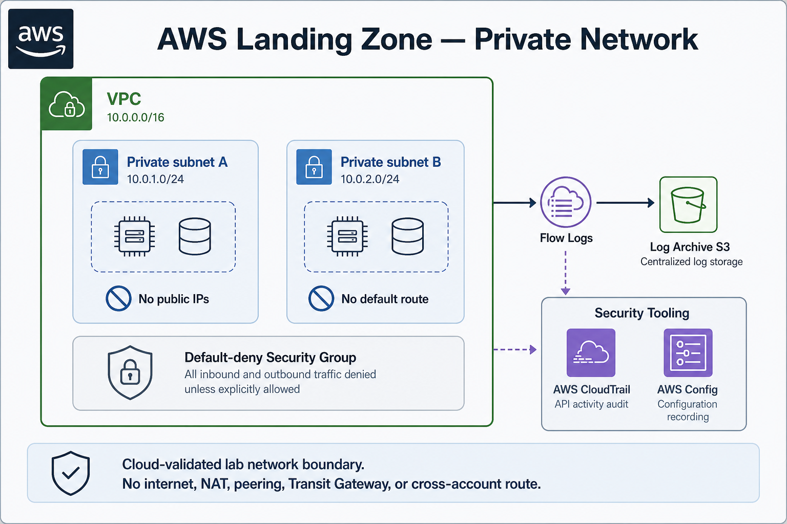

# AWS Landing Zone Lab

Terraform + GitHub OIDC CI. **Cloud-validated** single-account lab in `us-east-1`: identity, private network, and audit. Multi-account Orgs/OU/SCP interfaces stay design-only.

## Diagrams

<p align="center">
  
</p>

<p align="center"><em>Figure 1 — full lab poster (architecture · how it works · network)</em></p>

<p align="center">
  
</p>

<p align="center"><em>Figure 2 — platform architecture</em></p>

<p align="center">
  
</p>

<p align="center"><em>Figure 3 — how the live lab works</em></p>

<p align="center">
  
</p>

<p align="center"><em>Figure 4 — private network detail</em></p>

Editable draw.io sources: [`lab`](project-a/docs/diagrams/aws-landing-zone-lab.drawio) · [`architecture`](project-a/docs/diagrams/aws-landing-zone-architecture.drawio) · [`how-it-works`](project-a/docs/diagrams/aws-landing-zone-how-it-works.drawio)

| Panel | What it shows |
|-------|----------------|
| **Architecture** | Bootstrap → Organization (design) → Identity → Network → Audit → Validation. Live lab applied identity + network + audit in one account. |
| **How it works** | Push → OIDC → Terraform (one account) → live resources → evidence. |
| **Private network** | Private subnets, default-deny SG, Flow Logs → Log Archive. No internet, NAT, peering, Transit Gateway, or cross-account route. |

## Resume bullet

> Designed a multi-account AWS Landing Zone (Orgs/OU/SCP interfaces) and cloud-validated a single-account lab composition of identity, private network, and audit (CloudTrail/KMS Log Archive) in `us-east-1` with Terraform, evidence, and CI-gated delivery.

## Proven vs not

**Cloud-validated (live lab)** — single-account `us-east-1`; OIDC role `project-a-lzlab-gha`; private VPC + flow logs; CloudTrail / Config / KMS Log Archive; CI-gated Terraform apply with written evidence.

**Not proven** — multi-account Organizations with real member accounts; enterprise production operations; Azure Government (translation docs only). This repository does **not** prove production deployment or senior-level platform ownership.

Details: [`project-a/docs/portfolio/claims-boundary.md`](project-a/docs/portfolio/claims-boundary.md).

## Where to look next

| Want… | Go here |
|-------|---------|
| Project docs entry | [`project-a/README.md`](project-a/README.md) |
| Architecture contract | [`project-a/docs/architecture/overview.md`](project-a/docs/architecture/overview.md) |
| Live lab evidence | [`project-a/sandbox/landing-zone-lab/EVIDENCE.md`](project-a/sandbox/landing-zone-lab/EVIDENCE.md) |
| Orgs design interface | [`project-a/sandbox/landing-zone-lab/ORGS_INTERFACE.md`](project-a/sandbox/landing-zone-lab/ORGS_INTERFACE.md) |

## Harness (repo tooling)

Native-Windows smoke harness for one sequential Ralphy loop — separate from the Landing Zone lab story above.

```powershell
./scripts/Start-Harness.ps1 -DryRun
./scripts/Start-Harness.ps1
```

Details: [`project-a/HARNESS.md`](project-a/HARNESS.md).
