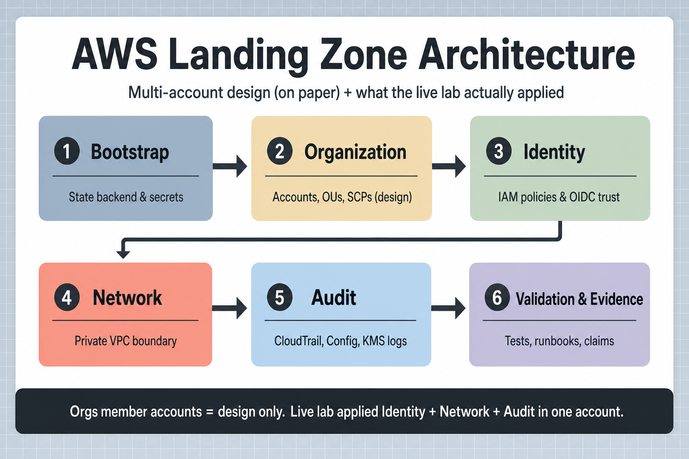
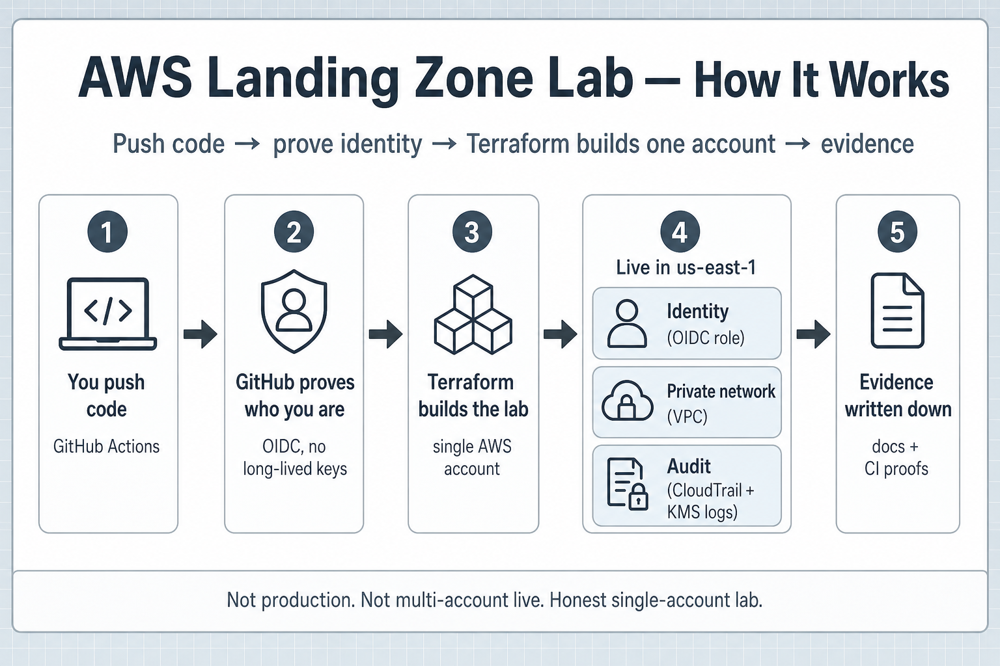

# AWS Landing Zone Lab

Terraform + GitHub OIDC CI. Designs a multi-account AWS Landing Zone, then proves a **single-account** live lab: identity, private network, and audit in `us-east-1`.

## Architecture (what the platform is)

<p align="center">
  
</p>

<p align="center">
  <a href="project-a/docs/diagrams/aws-landing-zone-architecture.drawio">draw.io</a>
  ·
  <a href="project-a/docs/diagrams/aws-landing-zone-architecture.svg">SVG</a>
</p>

Six building blocks. Left-to-right then down: bootstrap state, org layout (design), identity trust, private network, audit logging, then validation/evidence. The footer on the image is the claims line — Orgs members stay design-only; the live lab applied identity + network + audit in one account.

## How the live lab works

<p align="center">
  
</p>

<p align="center">
  <a href="project-a/docs/diagrams/aws-landing-zone-how-it-works.drawio">draw.io</a>
  ·
  <a href="project-a/docs/diagrams/aws-landing-zone-how-it-works.svg">SVG</a>
</p>

| Step | Plain English | AWS / CI meaning |
|------|---------------|------------------|
| 1 | You push code | GitHub Actions starts |
| 2 | GitHub proves who you are | OIDC — short-lived role, no static AWS keys in the repo |
| 3 | Terraform builds the lab | One commercial AWS account (`<AWS_ACCOUNT_ID>`) |
| 4 | Stuff shows up live | Identity role, private VPC + flow logs, CloudTrail / Config / KMS Log Archive |
| 5 | Evidence gets written down | Lab `EVIDENCE.md`, CI run links, claims boundary |

## Resume bullet (honest)

> Designed a multi-account AWS Landing Zone (Orgs/OU/SCP interfaces) and cloud-validated a single-account lab composition of identity, private network, and audit (CloudTrail/KMS Log Archive) in `us-east-1` with Terraform, evidence, and CI-gated delivery.

## Proven vs not

**Proven (live lab)** — single-account `us-east-1`; OIDC role `project-a-lzlab-gha`; private VPC + flow logs; CloudTrail / Config / KMS Log Archive; CI-gated Terraform apply with written evidence.

**Not proven** — multi-account Organizations with real member accounts; production ops; Azure Government (translation docs only).

Details: [`project-a/docs/portfolio/claims-boundary.md`](project-a/docs/portfolio/claims-boundary.md).

## Where to look next

| Want… | Go here |
|-------|---------|
| Project docs entry | [`project-a/README.md`](project-a/README.md) |
| Architecture contract | [`project-a/docs/architecture/overview.md`](project-a/docs/architecture/overview.md) |
| Live lab evidence | [`project-a/sandbox/landing-zone-lab/EVIDENCE.md`](project-a/sandbox/landing-zone-lab/EVIDENCE.md) |
| Orgs design interface | [`project-a/sandbox/landing-zone-lab/ORGS_INTERFACE.md`](project-a/sandbox/landing-zone-lab/ORGS_INTERFACE.md) |
| Network detail SVG | [`project-a/docs/diagrams/network.svg`](project-a/docs/diagrams/network.svg) |

## Harness (repo tooling)

Native-Windows smoke harness for one sequential Ralphy loop — separate from the Landing Zone lab story above.

```powershell
./scripts/Start-Harness.ps1 -DryRun
./scripts/Start-Harness.ps1
```

Details: [`project-a/HARNESS.md`](project-a/HARNESS.md).
