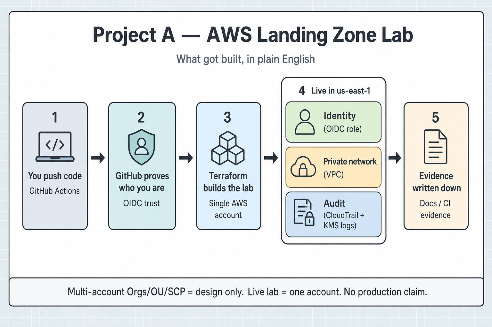

# Project A

AWS Landing Zone lab work: Terraform modules, CI-gated apply, and written evidence for what actually ran.

<p align="center">
  
</p>

<p align="center">
  <a href="project-a/docs/diagrams/project-a-landing-zone.drawio">Open the editable draw.io source</a>
  ·
  <a href="project-a/docs/diagrams/platform-eli5.svg">SVG version</a>
</p>

## In one breath

I designed a multi-account AWS Landing Zone on paper (Orgs / OU / SCP interfaces), then cloud-validated a **single-account** lab: identity, private network, and audit in `us-east-1`, delivered through Terraform and GitHub OIDC CI.

That sentence is the honest resume bullet. The rest of this page unpacks it.

## The diagram, step by step

| Step | Plain English | What that means in AWS terms |
|------|---------------|------------------------------|
| 1 | You push code | GitHub Actions workflow starts |
| 2 | GitHub proves who you are | OIDC federation — short-lived role assume, no static AWS keys in the repo |
| 3 | Terraform builds the lab | One commercial AWS account (`283077380808`) |
| 4 | Stuff shows up live | Identity role, private VPC + flow logs, CloudTrail / Config / KMS Log Archive |
| 5 | Evidence gets written down | Lab `EVIDENCE.md`, CI run links, claims boundary |

The dashed box on the left of the SVG/draw.io source is the multi-account design. It exists in Terraform and docs. It was **not** applied as Organizations member accounts in the live lab.

## What is proven vs what is not

**Proven (live lab)**

- Single-account composition in `us-east-1`
- Identity via GitHub OIDC → role `project-a-lzlab-gha`
- Private network (VPC + flow logs)
- Audit path (CloudTrail / Config / KMS Log Archive)
- CI-gated Terraform apply with written evidence

**Not proven**

- Multi-account Organizations with real member accounts
- Production operations or enterprise ownership
- Azure Government (translation docs only)

Full boundary language: [`project-a/docs/portfolio/claims-boundary.md`](project-a/docs/portfolio/claims-boundary.md).

## Where to look next

| Want… | Go here |
|-------|---------|
| Project A entry point | [`project-a/README.md`](project-a/README.md) |
| Architecture contract | [`project-a/docs/architecture/overview.md`](project-a/docs/architecture/overview.md) |
| Live lab evidence | [`project-a/sandbox/landing-zone-lab/EVIDENCE.md`](project-a/sandbox/landing-zone-lab/EVIDENCE.md) |
| Orgs design interface (not live members) | [`project-a/sandbox/landing-zone-lab/ORGS_INTERFACE.md`](project-a/sandbox/landing-zone-lab/ORGS_INTERFACE.md) |
| Older platform / network diagrams | [`platform.svg`](project-a/docs/diagrams/platform.svg) · [`network.svg`](project-a/docs/diagrams/network.svg) |

## Harness (repo tooling)

This repo also ships a native-Windows, Codex-first smoke harness for one sequential Ralphy loop. That path is separate from the Landing Zone lab story above.

```powershell
./scripts/Start-Harness.ps1 -DryRun
./scripts/Start-Harness.ps1
```

Details: [`project-a/HARNESS.md`](project-a/HARNESS.md). Verbose logs stay outside the repo under `%LOCALAPPDATA%\RalphyHarness\cloud`.
