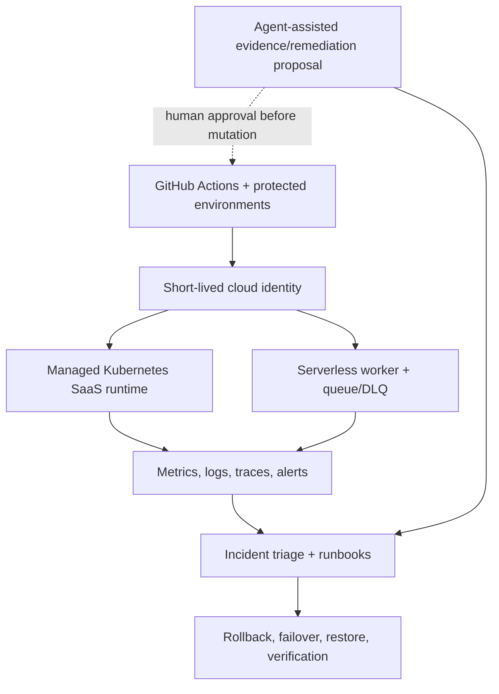

# ContinuityOps Master Plan

Plan ID: `continuityops-cloud-reliability-v1`  
Initial status: `candidate-specification`  
Former code name: `Project F`  
Primary delivery model: concurrent disjoint Ralphy streams followed by
post-build logical repartition and saved-council/fresh-council certification  
Primary cloud: AWS isolated single-account lab  
Azure posture: implemented governance/network companion only where separately
authorized and evidenced  
Lead orchestrator: Grok 4.5 High Fast

## 1. Outcome

Build and prove an end-to-end cloud reliability and recovery platform around an
existing containerized SaaS application. The finished portfolio should show
that its operator can:

- consume pre-existing infrastructure and release artifacts without rewriting
  them;
- run a service on managed Kubernetes;
- operate an event-driven serverless path;
- define and measure SaaS service levels;
- observe symptoms through metrics, logs, traces, dashboards, and alerts;
- diagnose Linux, application, DNS, TLS, load-balancer, routing, security-rule,
  Kubernetes, and dependency failures;
- choose among rollback, remediation, restart, failover, restore, and rebuild;
- test recovery objectives instead of documenting them only;
- enforce least privilege, secret discipline, policy gates, protected
  environments, and safe agentic automation;
- load-test, right-size, budget, and safely tear down the lab;
- produce evidence-backed incident reports, runbooks, postmortems, change
  records, and portfolio claims.

The project is a lab-grade operations platform. It must not imply enterprise
production tenure, 24/7 customer ownership, multi-account production, or Azure
networking depth that was not actually executed.

## 1A. Requested agent operating model

ContinuityOps uses a layered, cloud-oriented agent topology:

- Grok 4.5 High Fast is the lead orchestrator, judge, nixer, fixer, and
  bottleneck reasoning model;
- Codex 5.4 CLI Cloud Agents in `/fast` mode implement the codebase through
  bounded tasks;
- bottleneck subagents for auth, CI, cloud identity, Kubernetes,
  observability/dashboard, browser, or toolchain stalls are provisioned in the
  same supervisory session;
- all worker instructions, status, handoffs, and inter-agent communication are
  Simplified Chinese only;
- all recruiter-facing repository artifacts remain English.

Claude cloud agents and `pxpipe-proxy@0.9.0` are optional and not required for
this Grok-led track. Any reported quota effect is a hypothesis to measure, not
a plan assumption.

Where TypeScript is used, pin stable TypeScript 7.x; the initial verified
baseline is `typescript@7.0.2`. Use strict checking and full affected-partition
revalidation for any compiler change.

## 2. Upstream preservation contract

### Project A

Project A remains independently complete. ContinuityOps may consume only a
pinned, documented export contract:

- network identifiers and intended connectivity boundaries;
- IAM/OIDC role interfaces;
- audit/log destinations;
- Terraform state/output interfaces;
- naming, tagging, and governance policies;
- verified single-account lab evidence where it remains current.

No ContinuityOps task edits Project A. If an export is absent, create a
ContinuityOps-side adapter or record a blocking integration gap. Do not silently
change A or claim its multi-account design was deployed.

### Project C

Project C remains independently complete. ContinuityOps may consume only a
pinned release contract:

- immutable image digest and registry location;
- application version and Git commit identity;
- liveness/readiness/version/business smoke endpoints;
- configuration and secret interfaces;
- delivery evidence and known-good rollback target when verified.

If Project C has not yet completed immutable digest promotion, append-only
release evidence, authorized Jenkins promotion, or verified rollback, record
that boundary. ContinuityOps may build its own isolated lab release from a
pinned source SHA, but must label it a ContinuityOps lab artifact rather than a
Project C production release.

### Integration manifest

Create `integration/upstreams.lock.json`. Any upstream pin change invalidates
integration validation and all downstream slice evidence.

## 3. Target architecture



### Runtime components

- managed Kubernetes cluster in an isolated lab account/environment;
- Helm release for the Project C-derived application;
- ingress/load balancer, DNS/TLS where an owned test domain is authorized, or a
  documented lab endpoint without invented DNS claims;
- managed database or intentionally lightweight stateful dependency with
  explicit backup and restore boundaries;
- queue plus dead-letter queue;
- serverless event processor demonstrating retries, timeouts, idempotency,
  concurrency, and poison-message handling;
- OpenTelemetry-compatible instrumentation;
- central metrics, logs, traces, dashboards, and actionable alerts;
- GitHub-hosted deployment and evidence workflows using OIDC;
- agent-assisted read-mostly operations workflow with human-gated mutation;
- cost budgets, tags, teardown workflow, and retained post-teardown evidence.

### Environment boundaries

| Environment | Purpose | Mutation authority | Data |
| --- | --- | --- | --- |
| `local` | fast tests, kind/container checks, fault-script development | developer/local agent | synthetic only |
| `staging` | hosted integration and non-destructive incident tests | GitHub OIDC staging role | synthetic only |
| `recovery-lab` | destructive rollback/restore/failure drills | protected GitHub environment + human approval | synthetic seeded dataset |
| `portfolio-demo` | stable read-only demonstration endpoint if retained | protected workflow only | synthetic only |

No task calls an environment `production` unless the repository consistently
uses `lab-production` or `portfolio-demo` and explicitly disclaims customer
production.

## 4. Technology decisions

The implementation may adjust exact managed services during Phase 0 engineering
review, but must preserve the capabilities below.

| Capability | Preferred implementation | Required proof |
| --- | --- | --- |
| Infrastructure | Terraform with remote S3 state, versioning, encryption, lockfile, environment keys | plan/apply identity, state isolation, drift/blocked-change evidence |
| Kubernetes | EKS plus Helm; kind for preflight only | live pod/ingress/autoscaling/failure/recovery evidence |
| Serverless | Lambda + SQS + DLQ | retry, idempotency, poison message, replay, alarm, cost evidence |
| Observability | OpenTelemetry + CloudWatch/managed metrics and trace destination | correlated trace/log/metric path and dashboards |
| CI/CD | GitHub Actions OIDC; Project C artifact contract | pinned actions, protected environments, immutable digest, safe failure demo |
| Security | IAM least privilege, Kubernetes RBAC/network policies, secret manager, scanners/SBOM, policy checks | negative authorization and prohibited-deployment tests |
| Agentic workflow | GitHub workflow that gathers evidence and proposes remediation | no default write authority, approval gate, unsafe proposal rejection |
| Recovery | versioned backups/snapshots plus tested restore | measured RTO/RPO and post-restore business verification |
| Cost | budget/alert, tags, right-sizing, scheduled teardown | cost estimate, actual lab cost snapshot where available, teardown proof |

Use pinned containers or checksums for unstable external scanners/installers.
Do not depend on mutable `latest` installers in a merge gate.

## 5. Repository layout

```text
continuityops/
  .github/workflows/
  app-contract/
  integration/
  terraform/
  kubernetes/
  serverless/
  observability/
  operations/
  agentic/
  tests/
  scripts/
  harness/
  evidence/
  docs/
  AGENTS.md
  PLAN.md
  STATUS.md
  ISSUES.md
  DECISIONS.md
  BREAK_FIX_LOG.md
```

## 6. Construction partition and stream strategy

The starting code is treated as a candidate, not as verified merely because it
exists. Phase 0 inventories every file and produces a content-addressed
partition manifest. Each path has exactly one primary slice owner. Shared
interfaces are their own partition and are certified before dependent slices.

| Slice | Owned capability | Representative paths |
| --- | --- | --- |
| S0 | authority, harness, schemas, upstream pins | `PLAN.md`, `scripts/`, `harness/`, `integration/` |
| S1 | cloud foundation and delivery integration | `terraform/`, `.github/workflows/`, `app-contract/` |
| S2 | Kubernetes runtime | `kubernetes/` |
| S3 | serverless and SaaS operating contracts | `serverless/` |
| S4 | observability and SLOs | `observability/` |
| S5 | incident, Linux, and network operations | `operations/` |
| S6 | security, governance, and agentic workflow | `agentic/` |
| S7 | resilience, DR, performance, and FinOps | recovery/load/cost tests and change records |
| S8 | integrated evidence and portfolio delivery | evidence index, claims, final architecture |

Partition rules:

1. Hash the baseline tree and every partition file list.
2. Freeze a rubric before implementation begins.
3. A task policy lists `allowed_paths` and `adapter_owned_paths`.
4. The adapter alone stages append-only evidence and authoritative state.
5. Cross-partition changes require an interface-change issue and invalidate all
   affected dependent slice certifications.
6. A judge scores the candidate SHA, partition hash, and evidence manifest—not
   an uncommitted worktree.

### Simultaneous Ralphy streams

The supervisor may run up to three implementation streams simultaneously by
default after shared interfaces are frozen. Each stream is sequential internally
and owns one disjoint partition. Shared interface drift pauses dependent
streams. The lead orchestrator serializes integration through a recorded merge
queue.

### Completion repartition

After the complete codebase and tests are integrated, run a second dependency
audit, generate `postbuild-partition-manifest.json`, and certify each final
partition with saved-council then fresh-council process.

## 7. Delivery phases

### Phase 0 — Baseline, authority, and proof harness

Goal: convert the candidate into a safe, partitioned, resumable implementation
program.

Exit:

- S0 judge council passes;
- plan/execution/validator hashes are pinned;
- no cloud credentials or live changes occurred;
- human authorizes Phase 1 against the exact bundle.

### Phase 1 — Upstream integration and cloud control plane

Consume A/C outputs; create isolated hosted delivery path. Live apply remains
waiting-human until cost, role, and environment approvals are signed.

### Phase 2 — Managed Kubernetes runtime

Helm + EKS with immutable digest; kind is preflight only.

### Phase 3 — Serverless event path and SaaS operations

Queue-triggered worker with idempotency, DLQ, retries, and tenant lifecycle.

### Phase 4 — Observability and service-level engineering

OTel correlation, RED/USE metrics, actionable alerts, SLOs.

### Phase 5 — Incident, Linux, and network operations

Eight required drills with misleading-symptom coverage and resettable evidence.

### Phase 6 — Security, governance, and agent-assisted operations

Least privilege, scanners/SBOM, human-gated mutation, prompt-injection tests.

### Phase 7 — Resilience, DR, performance, and FinOps

Measured RTO/RPO, restore, load tests, cost, teardown.

### Phase 8 — Integrated certification and portfolio delivery

Evidence index rebuild, post-build repartition, fresh council, recruiter README.

## 7A. Saved-council judge experiment

Each completed partition first uses a saved remediation cohort. Provisional pass
is then tested by three completely fresh judges. Fresh judges are authoritative.
This experiment never lowers must-haves or the final 9.5 council threshold.

## 8. Deterministic validation matrix

Validators are allowlisted IDs with pinned implementations. Check-only
validators avoid tracked mutation. Cloud validators identify read-only or
mutation authority and target environment.

## 9. Human approval gates

| Gate | Human decision |
| --- | --- |
| H0 | project scope, architecture, cost cap, upstream pins |
| H1 | OIDC trust, Terraform state ownership, staging/recovery accounts and regions |
| H2 | first live Kubernetes/serverless apply |
| H3 | destructive incident/recovery drills |
| H4 | mutation-capable agent workflow |
| H5 | teardown or retained demo decision |
| H6 | final merge/public portfolio claims |

Agents cannot create receipts.

## 10. Schedule and cost envelope

Outcome-gated, not date-gated. Phase 0 sets a human-approved maximum lab budget
before live resources. Evidence must survive teardown without preserving
secrets.

## 11. Definition of portfolio-grade preparedness

Portfolio claims map only to evidence IDs. Missing employer-specific technology
or required years of production experience remain gaps even if this project is
fully executed.
