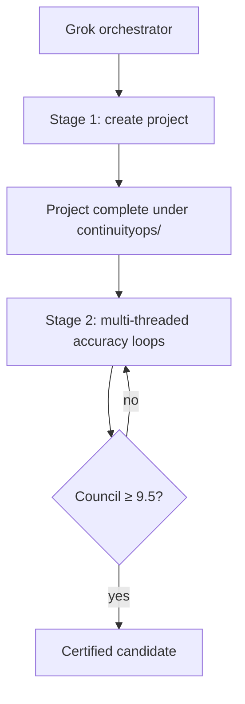

# ContinuityOps Master Plan

Plan ID: `continuityops-cloud-reliability-v1`  
Status: `fresh-council-remediation`  
Former code name: `Project F`  
Folder: `continuityops/` (independent project home; does not edit A or C)  
Lead orchestrator: Grok 4.5 High Fast  
Human gates while building: **none**

## 1. Outcome

Build and prove an end-to-end cloud reliability and recovery platform in an
isolated AWS lab around a containerized SaaS-style application owned under
`continuityops/`. The portfolio shows governed delivery, managed Kubernetes,
serverless + DLQ, observability/SLOs, incident ops, security/agentic safety,
and verified recovery/FinOps — without claiming sustained customer-production
SRE ownership.

## 2. Independence from Project A / Project C

- ContinuityOps lives only in `continuityops/`.
- **No edits** to `project-a/` or any Project C repository.
- Optional read-only reference notes may exist under `integration/` for
  learning adjacent contracts; they are not build blockers.
- Application images and IaC in this folder are **ContinuityOps lab
  artifacts**, not Project A/C production releases.

## 3. Ralphy structure (authoritative)

```text
Stage 1 — Build orchestration
  Grok orchestrator creates the full project under continuityops/
  via Codex /fast workers on disjoint paths.

Stage 2 — Accuracy / no-error loops (after project complete)
  Multi-threaded Ralphy accuracy loops (judge / nixer / fixer)
  until council score ≥ 9.5 (no judge < 9.0; all must-haves pass).
```

There are **no human approval gates during build**. Protected-main / mutation
safety is encoded as product design (agent proposes, workflows can still model
human-gate patterns in docs/diagrams) but does not pause the build loop.

## 4. Target architecture

Governed build → cloud runtime → observable incident → verified recovery.



Runtime capabilities (preferred):

| Capability | Preferred implementation |
| --- | --- |
| Infrastructure | Terraform, remote state, env keys |
| Kubernetes | EKS + Helm; kind for preflight |
| Serverless | Lambda + SQS + DLQ |
| Observability | OpenTelemetry + managed metrics/logs/traces |
| CI/CD | GitHub Actions OIDC patterns |
| Security / agentic | Least privilege; agent proposes, no default mutation |
| Recovery / FinOps | Backup/restore drills, load, cost, teardown evidence |

## 5. Repository layout

Everything below is under `continuityops/`:

```text
continuityops/
  .github/workflows/
  app-contract/
  integration/
  terraform/
  kubernetes/
  serverless/
  observability/
  operations/
  agentic/
  tests/
  scripts/
  harness/
  evidence/
  docs/
  AGENTS.md PLAN.md STATUS.md ISSUES.md DECISIONS.md BREAK_FIX_LOG.md
```

## 6. Construction slices (ownership during Stage 1)

| Slice | Capability | Paths |
| --- | --- | --- |
| S0 | authority, harness, orchestration | `PLAN.md`, `scripts/`, `harness/`, `integration/` |
| S1 | cloud foundation + delivery | `terraform/`, `.github/workflows/`, `app-contract/` |
| S2 | Kubernetes runtime | `kubernetes/` |
| S3 | serverless + SaaS contracts | `serverless/` |
| S4 | observability + SLOs | `observability/` |
| S5 | incident / Linux / network ops | `operations/` |
| S6 | security + agentic | `agentic/` |
| S7 | resilience / DR / perf / FinOps | drills, load, cost under ops/tests |
| S8 | evidence + portfolio delivery | `evidence/`, `docs/claims/`, README |

## 7. Stage 1 — Build orchestration

Goal: produce a complete ContinuityOps codebase and tests under
`continuityops/`.

Orchestrator duties:

- Inventory and partition paths
- Dispatch Codex `/fast` workers on disjoint slices
- Serialize shared-interface merges
- Keep Mandarin worker handoffs; English recruiter artifacts
- Advance without waiting on human receipts

Exit: project tree complete enough to enter Stage 2 (all slices present with
implementations or honest stubs replaced by real lab code as streams finish).

## 8. Stage 2 — Multi-threaded accuracy / no-error loops

Goal: eliminate errors and raise quality until council **≥ 9.5**.

Rules:

- Multi-threaded Ralphy accuracy loops are allowed and expected
- Each loop: score → nix findings → fix → re-validate → re-score
- Stop only when average ≥ 9.5, no judge < 9.0, all must-haves pass
- Accuracy loops must not edit outside `continuityops/`

## 9. Validation

Allowlisted ContinuityOps validators under `scripts/`. Check-only validators
avoid unrelated mutation. Path scope must remain inside `continuityops/`.

## 10. Claim boundary

Lab-grade evidence only. Footer for recruiter surfaces:

> Isolated synthetic-data cloud lab with evidence-backed runtime and recovery
> drills; not a claim of sustained customer-production SRE ownership.
