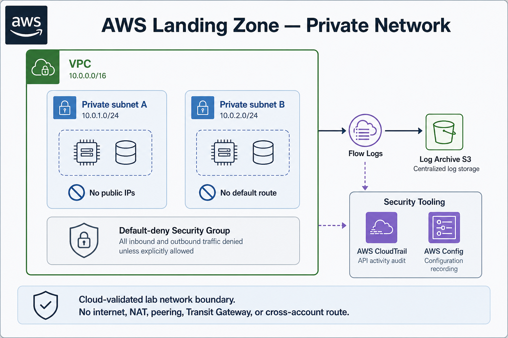

# Network architecture

## Ownership boundaries

| Account | Owns | Does not own |
| --- | --- | --- |
| **Network** | The proposed VPC boundary: per-environment VPCs, private subnets, private route tables, default-deny workload security groups, and VPC Flow Logs emission to a typed Log Archive S3 ARN | Log Archive bucket/KMS posture, CloudTrail/Config trail interfaces, or Security Tooling runtime services |
| **Log Archive** | Protected storage that receives flow-log objects (and other audit deliveries) after a separately controlled deployment | VPC CIDRs, routes, or security-group exceptions |
| **Security Tooling** | Centralized audit path interfaces that consume the same archive destination | Network account VPC ownership |

The Network account owns the proposed VPC boundary. Each environment receives a
separate VPC and at least two private subnets in distinct availability zones.
CIDRs, regions, and availability zones are typed inputs until human approval;
the template accepts RFC 1918 VPC CIDRs only.

Private subnets do not assign public IPs. Their route table has no default route,
so it provides no internet or cross-account path. The workload security group is
default-deny: no ingress and no egress rules are defined. Fail-closed inputs
`allow_unrestricted_ingress` and `allow_unrestricted_egress` default to deny and
are extension-blocked. Typed `sg_exception_attempts` (CIDR / port / protocol)
defaults to empty and is extension-blocked; any non-empty exception shape fails
offline validation. Any required ingress or egress exception needs a source,
destination, protocol, port, owner, expiry, and human review. Private subnet
CIDRs must sit inside the VPC prefix and must not overlap.

VPC Flow Logs capture `ALL` traffic metadata to a supplied Log Archive S3 ARN.
This is an interface only; **Log Archive owns the protected storage** (bucket
policy, retention, encryption, and public-access blocking). Flow Logs do not
capture application payloads. Network ownership stops at emission to the approved
ARN; Security Tooling owns trail/Config path semantics that share that archive.

Transit Gateway, Network Firewall, NAT gateways, centralized egress, peering,
VPN, Direct Connect, and RAM shares are extension points—not implemented
connectivity. This repository is not cloud validated and does not deploy AWS or
Azure resources.

See [network failure cases](../operations/network-failure-cases.md), the
[blocked-change catalog](../operations/blocked-change-catalog.md), and the
[network module](../../terraform/network/README.md).
