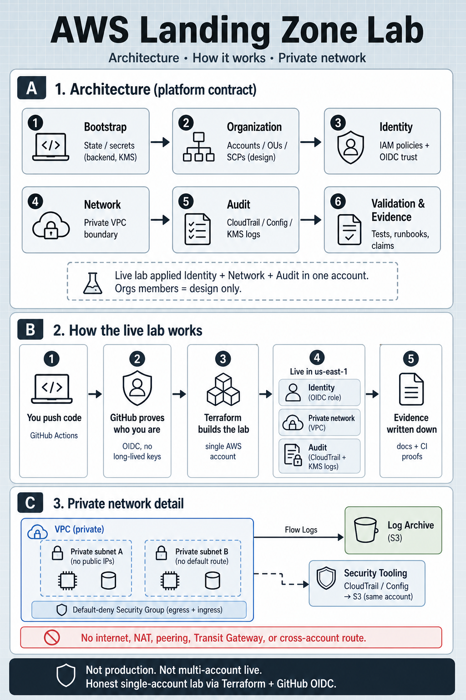

# AWS Landing Zone Lab (`project-a/`)

Terraform modules, CI-gated apply, and written evidence for an AWS Landing Zone design plus a single-account live lab.

## The figure (architecture · how it works · network)

<p align="center">
  
</p>

<p align="center">
  <a href="docs/diagrams/aws-landing-zone-lab.drawio">draw.io</a>
  ·
  <a href="docs/diagrams/aws-landing-zone-lab.svg">SVG</a>
  ·
  <a href="docs/diagrams/network.svg">network.svg (panel C source)</a>
</p>

Most of this folder is a **repo-only** multi-account platform contract: inspectable Terraform, docs, harness gates, and A-001…A-007 evidence that is **not** cloud-validated. Azure Government stays translation-only.

Separately, the **single-account Landing Zone lab** under
[`sandbox/landing-zone-lab`](sandbox/landing-zone-lab/EVIDENCE.md) was
**cloud-validated** in account `<AWS_ACCOUNT_ID>` / `us-east-1` via GitHub OIDC →
Terraform CI (role `project-a-lzlab-gha`): identity + private network + audit
(CloudTrail/KMS Log Archive). Organizations member accounts were **not**
created; Orgs/OU/SCP stays a design interface
([`ORGS_INTERFACE.md`](sandbox/landing-zone-lab/ORGS_INTERFACE.md)).

Earlier audit-only sandbox: [`sandbox/aws-proof`](sandbox/aws-proof/EVIDENCE.md).

### Honest resume bullet

> Designed a multi-account AWS Landing Zone (Orgs/OU/SCP interfaces) and
> cloud-validated a single-account lab composition of identity, private
> network, and audit (CloudTrail/KMS Log Archive) in `us-east-1` with
> Terraform, evidence, and CI-gated delivery.

### Delivery path

1. [Architecture overview](docs/architecture/overview.md)
2. [Evidence index](evidence-index.md)
3. [Claims boundary](docs/portfolio/claims-boundary.md)
4. [Pushback and handoff](docs/review/pushback-and-handoff.md)
5. [Azure Government readiness](docs/azure-government/readiness.md) (translation-only)

[Graphify report](graphify-out/GRAPH_REPORT.md) is navigation only — not cloud proof.

Fresh-clone Windows one-command proof matching CI (pin fail-closed):

```powershell
$env:HARNESS_STRICT_PINS = '1'
pwsh -NoLogo -NoProfile -File ../scripts/Invoke-HarnessReleaseValidation.ps1
```

Details: [HARNESS.md](HARNESS.md).

This folder proves junior-to-mid infrastructure design work plus an honest
single-account live lab. It does **not** prove production readiness, senior
ownership, enterprise operations, or multi-account cloud validation.
