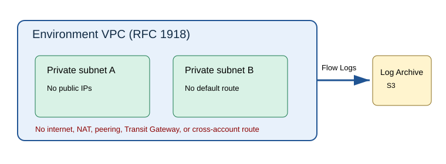

# Network architecture

The Network account owns the proposed VPC boundary. Each environment receives a
separate VPC and at least two private subnets in distinct availability zones.
CIDRs, regions, and availability zones are typed inputs until human approval;
the template accepts RFC 1918 VPC CIDRs only.

Private subnets do not assign public IPs. Their route table has no default route,
so it provides no internet or cross-account path. The workload security group is
default-deny: no ingress and no egress rules are defined. Any required ingress or
egress exception needs a source, destination, protocol, port, owner, expiry, and
human review.

VPC Flow Logs capture `ALL` traffic metadata to a supplied Log Archive S3 ARN.
This is an interface only; bucket policy, retention, encryption, and audit review
are defined by the later audit work. Flow Logs do not capture application payloads.

Transit Gateway, Network Firewall, NAT gateways, centralized egress, peering,
VPN, Direct Connect, and RAM shares are extension points—not implemented
connectivity. This repository is not cloud validated and does not deploy AWS or
Azure resources.

See [network failure cases](../operations/network-failure-cases.md) and the
[network module](../../terraform/network/README.md).
